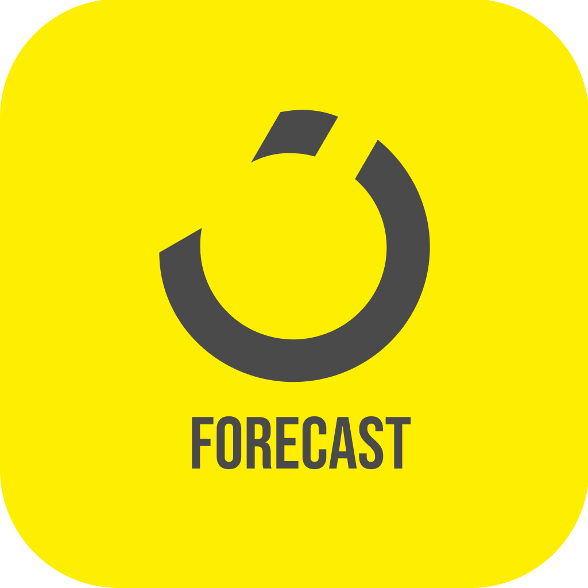

# noon forecast

<p align="center">

</p>


This repository contains a simple weather app built using React Native. The app retrieves weather data from a free weather API and displays it to the user. It was developed as a challenge for an interview with [noon](https://noon.com).

## Screenshots

<p align="center">
   
   &nbsp;&nbsp;&nbsp;&nbsp;&nbsp;&nbsp;&nbsp;
   
</p>

## Challenge Description

The challenge was to build a weather app using a free weather API. The API used for this project is [WeatherAPI](https://www.weatherapi.com/my/). The candidate had the freedom to choose the platform (iOS or Android) based on their development workstation's operating system (Windows/Linux or macOS). The UI and scope of the project were left for the candidate to decide.

## My Experience

This project is my first venture into React Native, and I must say it has been an incredibly enjoyable and exciting experience. As someone with a background in web development, I encountered certain challenges while transitioning my mindset to think in terms of mobile development and prioritize the user interface for a mobile application. However, the learning process was rewarding, and I enjoyed exploring the capabilities of React Native.

## Features

- Fetches weather data from the Weather API.
- Displays current weather information for user location such as temperature, weather condition, humidity, wind speed, etc.
- Supports viewing weather data for different locations.
- Provides a user-friendly interface to navigate and interact with the app.
- Light and Dark themes.
- Basic error handling.
- Developed for the Android platform.

## Installation

To run this weather app locally, follow these steps:

1. Make sure you have Node.js and yarn installed on your machine.
2. Clone this repository to your local machine.
   ```
   git clone https://github.com/mayyas-nakhli/noon-forecast.git
   ```
3. Navigate to the project directory.
   ```
   cd noon-forecast
   ```
4. Install the required dependencies.
   ```
   yarn i
   ```
5. Start the Metro server.
   ```
   yarn android
   ```

Make sure you have a suitable development environment set up for the chosen platform (iOS or Android).

## Project Structure

The project structure is as follows:

- `/src`: Contains the source code of the React Native app.
  - `/components`: Contains reusable UI components.
  - `/data`: Contains constants.
  - `/requests`: Contains the code for making API requests and the corresponding React Query definitions.
  - `/screens`: Contains different app screens.
  - `/utils`: Contains utility functions.
  - `/schemas`: Contains Zod schemas.
  - `/types`: Contains types and interfaces.
  - `/services`: Contains the definitions and configurations for the API Client and React Query Client, along with handlers for API responses and errors.
  - `/store`: Contains global stores for managing application state.
- `/assets`: Contains static assets like images and fonts.

## Dependencies

The main dependencies used in this project are:

- [React Native](https://reactnative.dev): A JavaScript framework for building native mobile apps.
- [Axios](https://axios-http.com): A popular HTTP client for making API requests.
- [Zod](https://zod.dev/): TypeScript-first schema validation with static type inference.
- [TanStack Query](https://tanstack.com/query/latest/): Powerful asynchronous state management for TS/JS, React, Solid, Vue and Svelte
- [Zustand](https://zustand-demo.pmnd.rs/): A small, fast and scalable bearbones state-management solution using simplified flux principles.
- [React Navigation](https://reactnavigation.org/): Routing and navigation for Expo and React Native apps.
- [Day.js](https://day.js.org/): Fast 2kB alternative to Moment.js with the same modern API.

Please refer to the `package.json` file for a complete list of dependencies and their versions.

## Assets

The app utilizes [MeteIcons](https://bas.dev/work/meteocons) SVG icon pcack (Had to convert them to png to ease the dynamic selection of weather icons), which adds visual appeal and enhances the overall user experience. The icons provide intuitive representations of different weather conditions, making it easier for users to understand the current weather at a glance.

The design of the app's UI/UX was inspired by [Tako Chkhikvadze's](https://dribbble.com/shots/18911229-weather-app) design, which served as a reference for creating an intuitive and visually pleasing interface. The design inspiration helped in crafting a cohesive and user-friendly experience for interacting with the weather data.

## Upcoming Features

In addition to the current features, the following enhancements are planned for future updates:

1. Add recent searched locations in search screen.
2. Implement a feature to save favorite locations, allowing users to easily access weather information for their preferred places.
3. Update location status and data when the user grant permission while the app is opened.
4. Implement different splash screen for each theme (light and dark).
5. Animate logo in splash screen.

These upcoming features aim to improve the user experience and provide more customization options within the app.

## Roadblocks and Areas of Growth

### Lack of Clear Documentation for Best Practices

As a new React Native developer, I struggled to find comprehensive documentation that clearly outlined best practices for development. This made it challenging to establish solid coding conventions and adhere to industry standards. I had to rely on trial and error to determine the most appropriate approaches for structuring code, managing state, handling navigation, and implementing UI components.

### Implementing Effective Global Error Handling for Async Operations

Error handling, particularly with asynchronous operations, proved to be a significant challenge. While I was familiar with handling synchronous errors using try-catch blocks, finding a global approach to handle async errors in a consistent and efficient manner was more difficult. I encountered difficulties in coordinating error handling across different asynchronous flows and ensuring proper error propagation and display.

Despite implementing basic error handling mechanisms, I found it fell below the acceptable level. I realized the importance of comprehensive error handling, including informative error messages, proper logging, and graceful error recovery or fallback strategies. This challenge highlighted the need for a deeper understanding of error handling patterns, asynchronous programming, and finding suitable techniques or libraries to facilitate global error handling in React Native.

Moving forward, I plan to invest more time in studying and practicing advanced error handling techniques, exploring available libraries or frameworks, and seeking guidance from experienced developers to enhance my skills in effectively managing async errors in React Native applications.


## License

This project is licensed under the [MIT License](LICENSE). Feel free to use and modify the code as per your needs.

## Acknowledgments

- The team at [noon](https://noon.com) for providing this coding challenge opportunity.
